<!-- 🌊 Animated Banner (self-hosted — commit banner.svg to this repo) -->


<!-- ⌨️ Typing Animation -->
<p align="center">
  <a href="https://github.com/obaida9521">
    
  </a>
</p>

<p align="center">
  <a href="https://www.linkedin.com/in/abu-obaida-693412280"></a>
  <a href="https://www.facebook.com/abuu.obaidaa"></a>
  <a href="https://www.instagram.com/abu.obaida53/"></a>
  
</p>

---

## 🚀 About Me

```yaml
name: Abu Obaida
role: Full Stack Developer
focus:
  - Mobile Apps (Flutter, Android Native)
  - Scalable Backends (Laravel, Node.js)
  - Real-time Systems (WebSockets, Queues, Workers)
  - DevOps & Infrastructure (VPS, AWS, Docker, Linux)
architecture: [MVVM, MVC, Clean Architecture, Monolith, OOP, SOLID]
currently: Building production-grade apps & backend systems end-to-end
```

- 💻 I build **complete products** — from mobile UI to backend APIs to server deployment
- 🏗️ Strong believer in **clean architecture**, **database design**, and writing maintainable code
- ☁️ Comfortable managing **production servers** — Nginx, Apache, SSL, CI/CD, monitoring
- 🔄 Experienced with **background jobs, queues, cron & real-time broadcasting**
- 📱 Published multiple mobile apps with full end-to-end ownership

---

## 🛠️ Tech Stack

### 📱 Mobile Development


**State Management & Libraries:**


### 🌐 Backend Development


**Frameworks & Ecosystem:**


### ⚡ Real-time & Background Processing


### 🎨 Frontend Development


**Styling & Tooling:**


### 🗄️ Databases & Storage


### ☁️ DevOps & Infrastructure


### 🧰 Tools & Environment


---

## 🏛️ Architecture & Principles

<p align="center">
  
  
  
  
  
  
  
  
</p>

---

## 📊 GitHub Stats

<p align="center">
  
  
</p>

<p align="center">
  
</p>

## 📈 Contribution Graph

<p align="center">
  
</p>

## 🏆 GitHub Trophies

<p align="center">
  
</p>

---

<h3 align="center">💬 Open to collaboration & interesting projects — let's build something great together!</h3>

<!-- 🌊 Animated Footer (self-hosted — commit footer.svg to this repo) -->

